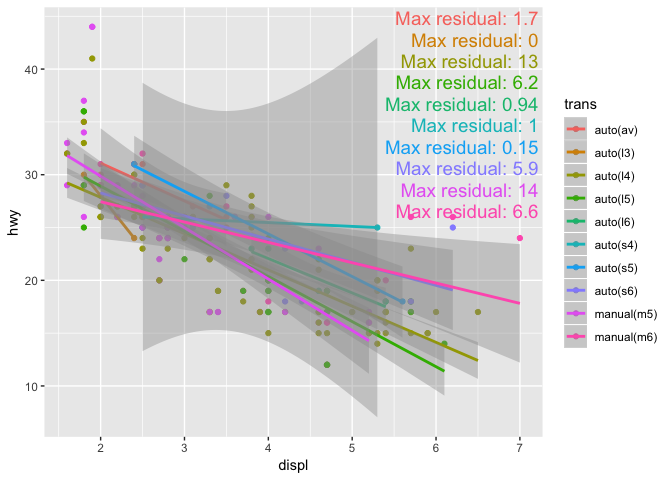
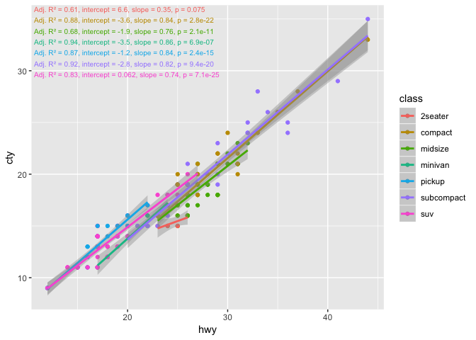

[](https://www.tidyverse.org/lifecycle/#experimental)

**gglmannotate** annotates a ggplot2 with a description of a linear
model.

# Installation

Install the development version from GitHub:

`devtools::install_github("wilkox/gglmannotate")`

# How to use

To add a description of a linear model to a scatter plot built with
ggplot2, just add `geom_lmannotate()`.

``` r
library(ggplot2)
library(gglmannotate)

ggplot(mpg, aes(x = displ, y = hwy)) +
  geom_point() +
  geom_smooth(method = "lm") +
  geom_lmannotate()
```


Grouping, for example by adding a colour aesthetic, is automatically
handled.

``` r
ggplot(mpg, aes(x = displ, y = hwy, colour = class)) +
  geom_point() +
  geom_smooth(method = "lm") +
  geom_lmannotate()
```


Faceting is also supported.

``` r
ggplot(mpg, aes(x = displ, y = hwy)) +
  geom_point() +
  geom_smooth(method = "lm") +
  geom_lmannotate() +
  facet_wrap(~ class)
```


# Customising the annotation text

The annotation can be changed from the default by setting the `glue_exp`
argument to `geom_lmannotate()`, which will be parsed with the `glue()`
function from the [glue](https://glue.tidyverse.org) package. This
allows interpolation of R variables and expressions. The linear model
object (the output of `lm()`) is available inside the glue expression as
the variable `model`. For example:

``` r
ggplot(mpg, aes(x = displ, y = hwy, colour = class)) +
  geom_point() +
  geom_smooth(method = "lm") +
  geom_lmannotate(glue_exp = "Max residual: {signif(max(model$residuals), 2)}")
```



# Customising the annotation placement

To change the region of the plot area in which annotations will be
drawn, use the `region` argument to `geom_lmannotate()`. It takes a
named numeric vector with elements ‘xmin’, ‘xmax’, ‘ymin’ and ‘ymax’,
all scaled between 0 and 1, to define the region.

The vertical and horizontal aliment of the text within the region can be
set with `place`. It accepts the following values: “right”,
“bottomright”, “bottom”, “bottomleft”, “left”, “topleft”, “top”, and
“centre|center|middle”.

``` r
ggplot(mpg, aes(x = hwy, y = cty, colour = class)) +
  geom_point() +
  geom_smooth(method = "lm") +
  geom_lmannotate(
    region = c(xmin = 0, xmax = 0.75, ymin = 0.75, ymax = 1),
    place = "topleft"
  )
```



The annotation text layout can be further tweaked with the `min.size`,
`grow` and `reflow` options. See the [ggfittext
package](https://github.com/wilkox/ggfittext) for full details on these
options.
