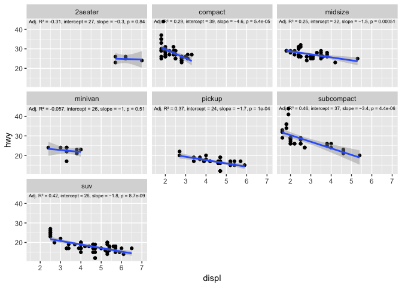
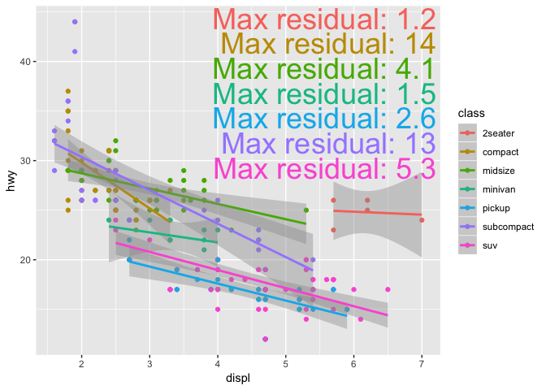

**gglmannotate** annotates a ggplot2 with a description of a linear
model.

# Installation

Install the development version from GitHub:

`devtools::install_github("wilkox/gglmannotate")`

# How to use

To add a description of a linear model to a scatter plot built with
ggplot2, just add `geom_lmannotate()`.

``` r
library(ggplot2)
library(gglmannotate)

ggplot(mpg, aes(x = displ, y = hwy)) +
  geom_point() +
  geom_smooth(method = "lm") +
  geom_lmannotate()
```


Grouping, for example by adding a colour aesthetic, is automatically
handled.

``` r
ggplot(mpg, aes(x = displ, y = hwy, colour = class)) +
  geom_point() +
  geom_smooth(method = "lm") +
  geom_lmannotate()
```


Faceting is also supported.

``` r
ggplot(mpg, aes(x = displ, y = hwy)) +
  geom_point() +
  geom_smooth(method = "lm") +
  geom_lmannotate(facet_mode = TRUE) +
  facet_wrap(~ class)
#> Warning: Ignoring unknown parameters: facet_mode
```



# Customising the annotation text

The annotation can be changed from the default by setting the `glue_exp`
argument to `geom_lmannotate()`, which will be parsed with the `glue()`
function from the [glue](https://glue.tidyverse.org) package. This
allows interpolation of R variables and expressions. The linear model
object (the output of `lm()`) is available inside the glue expression as
the variable `model`. For example:

``` r
ggplot(mpg, aes(x = displ, y = hwy, colour = trans)) +
  geom_point() +
  geom_smooth(method = "lm") +
  geom_lmannotate(glue_exp = "Max residual: {signif(max(model$residuals), 2)}")
#> Warning in qt((1 - level)/2, df): NaNs produced
```


