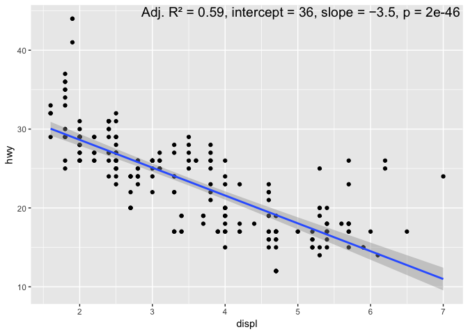

**gglmannotate** annotates a ggplot2 with a description of a linear
model.

# Installation

Install the development version from GitHub:

`devtools::install_github("wilkox/gglmannotate")`

# How to use

To add a description of a linear model to a scatter plot built with
ggplot2, just add `geom_lmannotate()`.

``` r
library(ggplot2)
library(gglmannotate)

ggplot(mpg, aes(x = displ, y = hwy)) +
  geom_point() +
  geom_smooth(method = "lm") +
  geom_lmannotate()
```



Grouping, for example by adding a colour aesthetic, is automatically
handled.

``` r
ggplot(mpg, aes(x = displ, y = hwy, colour = class)) +
  geom_point() +
  geom_smooth(method = "lm") +
  geom_lmannotate()
```


If you want to facet the plot, the description can be fixed in the upper
right corner with `facet_mode = TRUE`. Multiple groups in each facet are
not supported.

``` r
ggplot(mpg, aes(x = displ, y = hwy)) +
  geom_point() +
  geom_smooth(method = "lm") +
  geom_lmannotate(facet_mode = TRUE) +
  facet_wrap(~ class)
```


